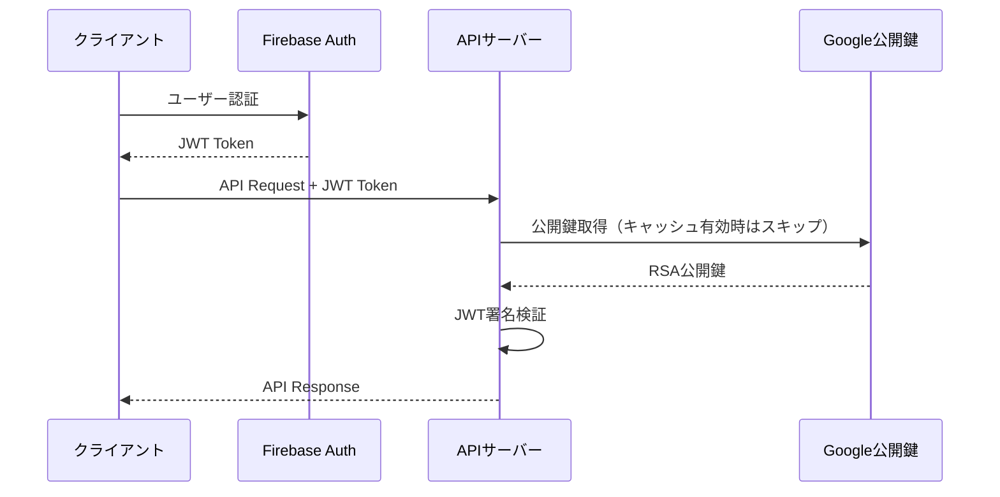

# 認証システム

[← トップページに戻る](./index.md)

## 🔐 Firebase JWT認証

このアプリケーションは、Firebase Authentication を使用したJWTベースの認証システムを採用しています。

## 🔑 実装概要

### JWT検証フロー

```mermaid
sequenceDiagram
    participant Client as クライアント
    participant Firebase as Firebase Auth
    participant API as APIサーバー
    participant Google as Google公開鍵

    Client->>Firebase: ユーザー認証
    Firebase-->>Client: JWT Token
    Client->>API: API Request + JWT Token
    API->>Google: 公開鍵取得（キャッシュ有効時はスキップ）
    Google-->>API: RSA公開鍵
    API->>API: JWT署名検証
    API-->>Client: API Response
```

